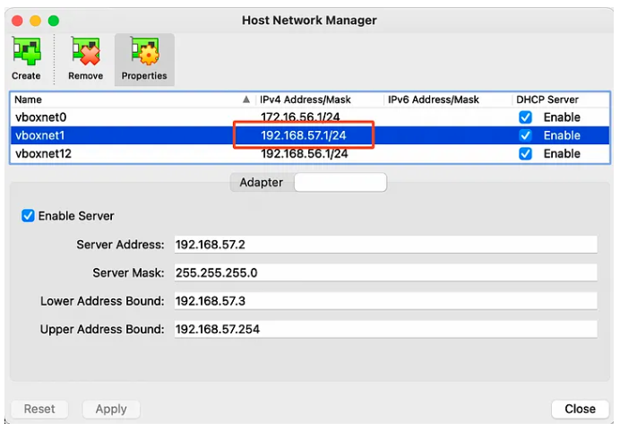

# create k8s cluster with virtual box

### install virtualbox and create network setting on virtual box 



### install vagrant on your system and run vagratn file 

```
wget -O- https://apt.releases.hashicorp.com/gpg | sudo gpg --dearmor -o /usr/share/keyrings/hashicorp-archive-keyring.gpg
echo "deb [signed-by=/usr/share/keyrings/hashicorp-archive-keyring.gpg] https://apt.releases.hashicorp.com $(lsb_release -cs) main" | sudo tee /etc/apt/sources.list.d/hashicorp.list
sudo apt update && sudo apt install vagrant
```
### create k8s cluster
it will take 15 mints depends on your system resources
```
vagrant up

```

### kubeconfig file 

ssh into master node and grap you kubeconfig file and setup on host machine 

```
vagrant ssh master  
cat /home/vagrant/.kube/config 
```
copy the contenct of this file and create a new file on your host and connect with kubectl 


# setup metallb 

```
kubectl apply -f ./metal-lb 
```

# you can create loadbalancer of your choice 

